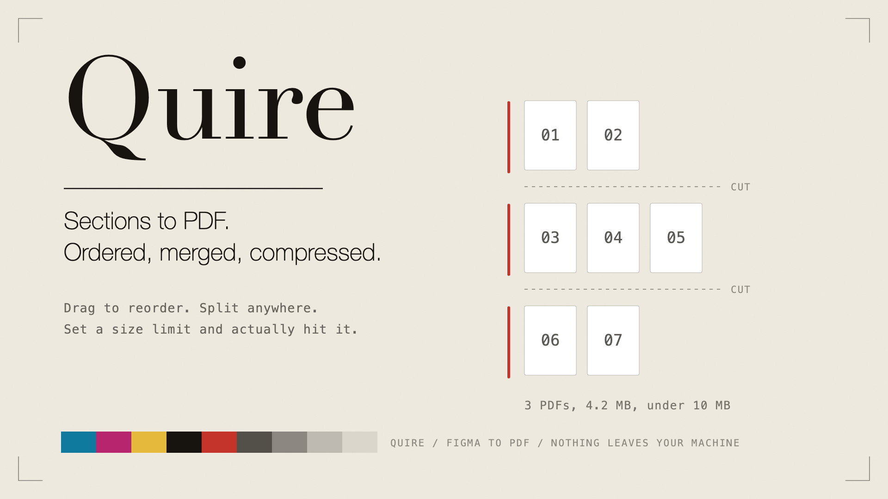

<p align="center">
  
</p>

<h1 align="center">Quire</h1>

<p align="center"><strong>Figma to PDF export with real compression.</strong><br>
Export a Figma section as a multi page PDF, reorder the pages, split it, and hit a file size limit.</p>

<p align="center">
  <a href="#install">Install</a> &middot;
  <a href="#how-the-pdf-compression-works">How compression works</a> &middot;
  <a href="#faq">FAQ</a> &middot;
  <a href="LICENSE">MIT</a>
</p>

<p align="center">
  
</p>

---

## What this solves

Figma can export several frames as one PDF. Two things it will not do: let you control
the page order beyond canvas position, and compress the result. If your document has
screenshots in it you get whatever size those images happen to be, with no way to land
under an email attachment limit.

Quire is a **Figma plugin to export sections as PDF**, with the missing half attached:
page ordering, document splitting, and genuine **PDF compression** that reduces file
size without turning your text into a picture.

**Common things people want that this does:**

| You want to | Quire does it |
| --- | --- |
| Export a Figma section to a multi page PDF | Select the section. Its frames become pages. |
| Merge Figma frames into one PDF | Combined mode, in canvas or alphabetical order |
| Compress a PDF exported from Figma | Downsamples and re-encodes embedded images |
| Reduce PDF file size for email | Set a 10 MB cap and Quire works down to it |
| Split a PDF into separate files | Drop break markers anywhere, or one PDF per page |
| Sort PDF pages alphabetically | Natural sort, so page 2 comes before page 10 |
| Reorder PDF pages by hand | Drag to reorder, saved into the Figma file |
| Compress images inside a PDF | Per image, based on how large it is actually drawn |
| Export a Figma presentation or case study as PDF | Any section of frames works |

## Features

- **Section to PDF.** Select a section, its frames become the pages. Loose frame
  selections work too.
- **Page ordering that sticks.** Canvas position, A to Z, Z to A, or drag by hand.
  Natural sort, so `D2-2` comes before `D2-10` instead of after it. Manual order is
  saved into the Figma file, so re-exporting next month does not mean re-dragging.
- **Split anywhere.** Break markers cut the document into separate PDFs at any point.
  Or emit one PDF per page. Multiple files download as a single ZIP.
- **Set a file size limit and hit it.** Presets for email (10 MB), web (5 MB) and print
  (uncapped), or type an exact number in MB.
- **Real image compression.** Images inside the PDF are downsampled and re-encoded
  based on how large they are actually drawn, not their pixel dimensions.
- **Text stays text.** Fonts stay embedded, the PDF stays selectable and searchable.
- **PDF bookmarks** generated from your frame names.
- **Resizable panel and adjustable text size**, remembered between sessions.
- **Nothing is uploaded.** All PDF work happens inside the plugin. The manifest
  declares no network access at all.

## Install

Not yet on the Figma Community. To run it now:

```bash
git clone https://github.com/wicolian/quire.git
cd quire
npm install
npm run build
```

In the **Figma desktop app**: `Plugins` then `Development` then
`Import plugin from manifest...` and pick `manifest.json` from this directory.

`npm run watch` rebuilds on change. Re-run the plugin in Figma to pick up a rebuild.

`npm run preview` renders the panel headlessly in both light and dark themes into
`preview/`. It is a layout check, not a functional one, but it catches overflow,
misalignment and contrast problems without a round trip through Figma.

## How the PDF compression works

Most PDF compressors either do nothing useful to a vector document or rasterize the
whole thing. Quire does neither by default.

```
1  export     each frame to Figma's own vector PDF
2  merge      combine into one document
3  dedupe     collapse identical streams (a logo on all 12 pages is embedded once)
4  placement  read the transform matrix at each draw to find the real displayed size
5  images     downsample and re-encode only what is above the target DPI
6  budget     over the cap? step quality down and retry, bounded at 3 passes
7  fallback   still over? offer to flatten to raster, never silently
```

**Step 4 is the part that matters.** A 2000px logo placed at 40pt is being displayed at
roughly 3600 DPI and is almost pure waste. The same bitmap spanning a full A4 page is a
reasonable 240 DPI and should be left nearly alone. Pixel dimensions alone cannot tell
those apart. Only the transformation matrix in force when the image is painted can.

Every image is guarded by one rule: it is replaced only when the result is both valid
and genuinely smaller. Exotic filters, indexed palettes and stencil masks are left
untouched. A slightly larger PDF is a far better outcome than a corrupted one.

### What it deliberately does not do

**Merging subsetted fonts.** Figma subsets fonts per export, so page 1's Inter subset is
usually not byte identical to page 5's, and stream dedupe will not fire on them.
Properly merging subsets is a much harder problem and is out of scope. Dedupe pays off
on images and repeated vector assets instead.

## FAQ

**Does this reduce PDF file size without losing quality?**
Dedupe is lossless and always runs. Image recompression is lossy but targeted: it only
touches images above your chosen DPI, and never enlarges a stream. Text and vectors are
never touched unless you explicitly choose the raster fallback.

**Will my text still be selectable and searchable?**
Yes. Fonts stay embedded and text stays as text. The one exception is the raster
flatten fallback, which is offered only when a size cap cannot be met and never applies
without you pressing the button.

**Why is my vector document not getting smaller?**
Because there is nothing to compress. A text and shape document has no raster images,
so the image pass correctly finds nothing to do. Compression earns its keep on
documents containing screenshots.

**Does it work in the Figma browser version?**
Development plugins require the Figma desktop app. Once published to the Community it
will run in both.

**Is my data uploaded anywhere?**
No. There is no network code and the manifest declares `"allowedDomains": ["none"]`.

**How do I export a Figma section as a multi page PDF?**
Select the section on canvas, open Quire, check the page order, press Export.

## Architecture

Figma plugins are two isolated realms, and the split follows that boundary:

```
+- SANDBOX (main) --------------+      +- UI (iframe) --------------------+
|  figma API, no DOM            |      |  DOM, canvas, pdf-lib, fflate    |
|                               | ---> |                                  |
|  selection.ts   discovery     | msg  |  Preact panel                    |
|  order-store.ts pluginData    | <--- |                                  |
|  exportAsync({PDF}) per node  |      |  core/  <- pure, no figma, no DOM|
+-------------------------------+      +----------------------------------+
```

`src/core/` is the load-bearing boundary: pure functions over bytes and plain objects,
no `figma` global, no DOM. All the risk lives there, and it is the only layer that can
be tested outside Figma. Pixel encoding is injected through an `ImageCodec` adapter:
`OffscreenCanvas` in the plugin, a pure JS codec in tests.

| Module | Responsibility |
| --- | --- |
| `core/ordering` | Natural sort, canvas sort, saved order reconciliation |
| `core/merge` | pdf-lib merge, content hash stream dedupe |
| `core/placement` | Content stream matrix scan to real drawn size per image |
| `core/images` | Find, decode, downsample, re-encode image XObjects |
| `core/budget` | Preset to params, size search, give up policy |
| `core/pipeline` | The whole export, start to finish |
| `core/raster` | The explicit flatten fallback |

## Tests

```bash
npm test
npm run typecheck
```

The suite builds its own PDF fixtures rather than committing binaries, so every input is
visible and adjustable. Those fixtures mimic the structures Figma emits (a vector page,
a JPEG photo, a Flate image with a soft mask, a logo repeated across pages) but they are
**synthetic**, and they cannot prove Quire survives everything real Figma output
contains.

To validate against the real thing: export some frames from Figma as PDF, one file per
frame, into `test/fixtures/real/`. `test/real-export.test.ts` picks them up
automatically and skips when the directory is empty. That directory is gitignored, so
no confidential documents end up in a public repo.

## Design

The panel is built around one idea: **the spine.** A hairline binds the page list down
its left edge. Dropping a break marker severs it, so "these become separate PDFs" is
something you see rather than something you read off a radio button. During export, ink
fills the spine from the top, page by page, so the progress indicator, the binding
indicator and the list structure are the same mark.

Design notes live in [`.interface-design/system.md`](.interface-design/system.md) and
the full record is in
[`docs/superpowers/specs/`](docs/superpowers/specs/2026-07-31-quire-design.md).

## Keywords

Figma PDF export, Figma to PDF, section to PDF, export Figma frames to PDF, multi page
PDF from Figma, compress PDF, reduce PDF file size, PDF compression plugin, merge PDF,
split PDF, combine Figma frames into one PDF, sort PDF pages, reorder PDF pages,
compress images in PDF, PDF size limit, email attachment size, Figma plugin, design to
PDF, presentation export, case study PDF, pitch deck PDF.

## License

MIT. See [LICENSE](LICENSE).
